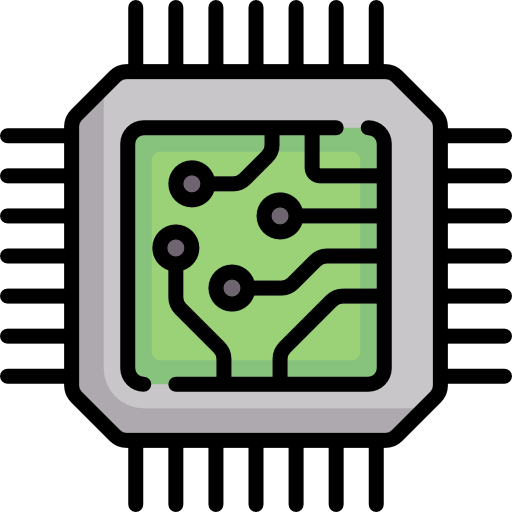
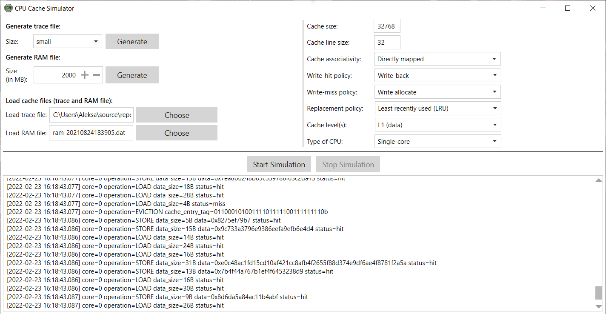
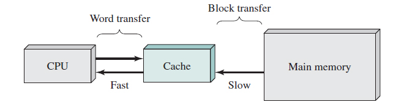

</img>

# Cache Simulator
<p align="justify"><b>Cache Simulator</b> was created for a <i>Computer Architecture</i> course project, as taught at the Faculty of Electrical Engineering Banja Luka. The project has been since expanded and updated. This simulator is known as a <i>trace-driven</i> simulator because it takes as input a trace of events.  The memory reference events speciefied in the trace(s) will be used by the simulator to drive the movement of data in and out of cache, thus simulating its behavior. The motivation behind this project was a better understanding of the inner working of the cache memory and its policies. </p>

## Table of contents
- [Cache Simulator](#cache-simulator)
  - [Table of contents](#table-of-contents)
  - [Introduction](#introduction)
  - [Cache design](#cache-design)
    - [Cache entry](#cache-entry)
  - [Replacement policies](#replacement-policies)
    - [LRU (Least-recently used)](#lru-least-recently-used)
    - [Bélády's algorithm](#béládys-algorithm)
  - [Write policies](#write-policies)
    - [Write-hit policies](#write-hit-policies)
    - [Write-miss policies (allocation policies)](#write-miss-policies-allocation-policies)
  - [Associativity (placement policy)](#associativity-placement-policy)
    - [Direct-mapped cache](#direct-mapped-cache)
  - [Ram memory](#ram-memory)
  - [Trace file](#trace-file)
  - [Statistics (cache performance)](#statistics-cache-performance)
    - [LRU vs Bélády](#lru-vs-bélády)
  - [References](#references)
    - [Books](#books)
    - [Links](#links)
    - [Github projects](#github-projects)
  - [To-Do List](#to-do-list)

## Introduction
<p align="justify"><b>Cache Simulator</b> is a simulator implemented in C#. It supports directly mapped, N-way set associative or fully associative cache memory. It also allows LRU (Least Recently Used), Bélády's or Random replacement policy. The cache is simulated inside of the computer's RAM memory and the simulated RAM is stored on the computer's NTFS file system. Data is transfered between memory and cache in blocks of fixed sizes, called cache lines. When a cache line is copied from memory into the cache, cache entry is created. It will create entry that contains copied data as well as the requested memory location (tag).<p align="center"></p>
<p align="justify">The cache simulator first checks the users inputs. After it checks the validity of input parameters, program starts reading lines from trace file. After checking the input values, the simulator calculates number of lines, set size, number of sets, block offset length and set index length. After that, since we need to a cache in order to read and write to, <a href="https://stackoverflow.com/questions/22756092/what-does-it-mean-by-cold-cache-and-warm-cache-concept"><b>cold cache</b></a> is created. Simulator does that by calling a method <code>CreateColdCache()</code>.<br><br>
Currently there is only one cache memory level L1, or L1-D to be exact. The plan is to expand project to support both, L1-I (for instructions) and L1-D (for data), as well as the L2 shared cache memory for CPU cores. For the simulation purposes L2 should be made slower when reading/fetching data and it should be smaller than L1.</p>

<p align="center"></p>

<p align="justify">For mapping purposes, this memory is considered to consist of n number of fixed-length blocks of K words each. That is, there are M = 2n/K blocks. Cache consists of C slots (also referred to as lines) of K words each, and the number of slots is considerably smaller than the number of main memory blocks (<code>C << M</code>).
<br><br>
If a word in a block of memory that is not in the cache is read, that block is transferred to one of the slots of the cache. Because there are more blocks than slots, an individual slot cannot be uniquely and permanently dedicated to a particular block. Therefore, each slot includes a tag that identifies which particular block is currently being stored.</p>

## Cache design
<p align="justify">Some of the key elements are briefly summarized here. Some of the important elements of cache that should be configurable based on the arguments given as input are:
<ul>
  <li>Cache size</li>
  <li>Block size (or line size)</li>
  <li>Number of ways of set-associativity (1, N, ∞)</li>
  <li>Eviction policy</li>
  <li>Write policy</li>
  <li>Number of levels of cache</li>
  <li>Separate I-cache from D-cache, or unified cache (Von Neumann. or Harvard)</li>
</ul>
<p align="justify">Block size is the unit of data exchanged between cache and main memory. As the block size increases from very small to larger sizes, the hit ratio will at first
increase because of the principle of locality: the high probability that data in the
vicinity of a referenced word are likely to be referenced in the near future. As the block size increases, more useful data are brought into the cache. The hit ratio will
begin to decrease, however, as the block becomes even bigger and the probability of
using the newly fetched data becomes less than the probability of reusing the data that have to be moved out of the cache to make room for the new block.
<br><br>
If the contents of a block in the cache are altered, then it is necessary to write it back to main memory before replacing it. The write policy dictates when the memory write operation takes place. At one extreme, the writing can occur every time that the block is updated. At the other extreme, the writing occurs only when the block is replaced. The latter policy minimizes memory write operations but leaves main memory in an obsolete state.</p>

### Cache entry
<p align="justify">Cache row entries usually have the following structure:</p>
 <table align="center">
  <tr>
    <td>Tag</td>
    <td>Data Block</td>
    <td>Flag Bits</td>
  </tr>
</table>
<p align="justify">The data block (cache line/block) contains the actual data fetched from the main memory. The tag contains (part of) the address of the actual data fetched from the main memory. The "size" of the cache is the amount of main memory data it can hold. This size can be calculated as the number of bytes stored in each data block times the number of blocks stored in the cache : 
<code>size(data_block) x count(cache_lines)</code> .<br><br>
An instruction cache requires only one flag bit per cache row entry, a valid bit. The valid bit indicates whether or not a cache block has been loaded with valid data. A data cache typically requires two flag bits per cache line – a valid bit and a dirty bit. Having a dirty bit set indicates that the associated cache line has been changed since it was read from main memory ("dirty"), meaning that the processor has written data to that line and the new value has not propagated all the way to main memory.  When simulation is first started all the valid bits in all the caches are set to "invalid".

</p>

## Replacement policies
<p align="justify">To make room for the new entry on a cache miss, the cache may have to evict one of the existing entries. Cache algorithms are algorithms that simulator uses to manage a cache of information. When the cache is full, the algorithm must choose which items to discard to make room for the new ones. The fundamental problem with any replacement policy is that it must predict which existing cache entry is least likely to be used in the future. Predicting the future is difficult, so there is no perfect method to choose among the variety of replacement policies available.</p>

### LRU (Least-recently used)
<p align="justify">Algorithm requeres keeping track of what was used when. This was accomplished by using an <i>age bit</i> for cache-lines and then track the LRU cache-line based on the age-bits.</p>

```C#
public int Age { get; set; } = 0;
```
<p align="justify">In this implementation, every time a cache-line is used, the age of all other cache-lines in the set changes.</p>

```C#
for (var i = limit; i < limit + Associativity; ++i)
{
    ++CacheEntries[i].Age;
}
```
<p align="justify">The algorithm allows for the least recently used items first to be discarded. In LRU strategy, when the cache is full, the item that hasn't been used for the longest time (least recently used item) will be eliminated or evicted from cache. It also provides a quick constant time access to items in cache.</p>

### Bélády's algorithm
<p align="justify">The most efficient caching algorithm would be to always discard the information that will not be needed for the longest time in the future. This optimal result is referred to as Bélády's optimal algorithm. Since it is generally impossible to predict how far in the future information will be needed, this is generally not implementable in practice. The practical minimum can be calculated only after experimentation, and one can compare the effectiveness of the actually chosen cache algorithm. For this program we know all of the instructions that will take place in the simulation because we have a finite set of instructions stored in the trace file.</p>

## Write policies
<p align="justify">If data is written to the cache, at some point it must also be written to main memory. The timing of this write is known as the write policy. Both write-through and write-back policies can use either of write-miss policies.</p>

### Write-hit policies
<p align="justify">When a system writes data to cache, it must at some point write that data to the backing store as well. The timing of this write is controlled by what is known as the write policy. There are two basic writing approaches:</p>
<ul>
  <li><p align="justify"><u>Write-through</u> (store through): write is done synchronously both to the cache and to the backing store.</p></li>
  <li><p align="justify"><u>Write-back</u> (copy-back or store-in): initially, writing is done only to the cache and isn't immediately mirrored to the main memory, and the cache instead tracks which locations have been written over, marking them as dirty. The write to the backing store is postponed until the modified content is about to be replaced by another cache block, an effect referred to as a <i>lazy write</i>. The process of writing data back to main memory when it is being replaced in the cache is called <i>eviction</i>. For this reason, a read miss in a <u>write-back</u> cache may sometimes require two memory accesses to service: one to first write the dirty location to main memory, and then another to read the new location from memory. Also, a write to a main memory location that is not yet mapped in a <u>write-back</u> cache may evict an already dirty location, thereby freeing that cache space for the new memory location.</p></li>
</ul>

<p align="justify">Below you can take a look at three possible states in a typical copy-back cache design.</p>

<table align="center">
  <tr>
    <th>Valid Bit</th>
    <th>Dirty Bit</th>
    <th>Status</th>
  </tr>
  <tr>
    <td><p align="center">0</p></td>
    <td><p align="center">X</p></td>
    <td><p align="left">Invalid Line</p></td>
  </tr>
  <tr>
    <td><p align="center">1</p></td>
    <td><p align="center">0</p></td>
    <td><p align="left">Valid Clean line that matches main memory</p></td>
  </tr>
  <tr>
    <td><p align="center">1</p></td>
    <td><p align="center">1</p></td>
    <td><p align="left">Valid Dirty line that is more current than main memory</p></td>
  </tr>
</table> 

### Write-miss policies (allocation policies)
<p align="justify">Since no data is returned to the requester on write operations, a decision needs to be made on write misses, whether or not data would be loaded into the cache. This is defined by these two approaches:
<ul>
  <li><p align="justify"><u>Write allocate</u> (fetch on write): data at the missed-write location is loaded to cache, followed by a write-hit operation. In this approach, write misses are similar to read misses.</p></li>
  <li><p align="justify"><u>No-write allocate</u> (no-write allocate or write around): data at the missed-write location is not loaded to cache, and is written directly to the backing store. In this approach, data is loaded into the cache on read misses only.</p></li>
</ul>

## Associativity (placement policy)
<p align="justify">The placement policy decides where in the cache a copy of a particular entry of main memory will go. If the placement policy is free to choose any entry in the cache to hold the copy, the cache is <i>fully associattive</i>. At the other extreme, if each entry in main memory can go in just one place in the cache, the cache is <i>directly mapped</i>. The comprimise between the two extreems, in which each entry in main memory can go to any of N places in the cache are described as <i>N-way set associative</i>. Choosing the right value of associativity involves a trade-off. If there is eight places to which the placement policy have mapped memory location, then to check if that location is in the cache, eight cache entries must be searched.</p>

### Direct-mapped cache
<p align="justify">It doesn't have a placement policy as such, since there is no choice of which cache entry's content to evict. This means that if two locatios map to the same entry, they continually knock each outher out. Although simpler, a direct-mapped cache needs to be much larger than an associative one to give comparable performance, and it is more unpredictable. It has a good best-case time but is unpredictable in worst case.</p>

## Ram memory
<p align="justify">Ram is represented with a large binary file stored on the file system. The binary file contains randomly written data. Ram files have the following name structure <i><code>file_name-DateTime.Now:yyyyMMddHHmmss.dat</code></i>, e.q. <i>ram-20210824183840.dat</i>. Below you can find an  example how to create a Ram file:<br></p>

```C#
var ramSize = 5_000_000;
var ram = new RamGenerator.RamGenerator(ramSize);
ram.GenerateRam();
```

## Trace file
<p align="justify">Trace file is the name of the text file which contains memory access traces. The trace files are in ASCII format, so they are human-readable form.  Each line in the trace file represents a single memory reference and contains the following data:
<table align="center">
  <tr>
    <td>instruction_type</td>
    <td>address</td>
    <td>size_of_data</td>
    <td>data</td>
  </tr>
</table>
The instruction type can be L (load) for when data is loaded or M (modify) when data is loaded and stored. The number following the intruction type is the byte address of the memory reference itself. This number is in hexadecimal format and it specifies a 64-bit byte address in the range <code>[0, Ram_size - dataBlockSize]</code>. Trace file is created similarly as the Ram file and they also have the same name structure, <i><code>file_name-DateTime.Now:yyyyMMddHHmmss.dat</code></i>, e.q. <i>instructions-20210824203302</i>. Below you can find an example how to create a trace file:<br></p>

```C#
var numberOfInstructions = 1_000;
var trace = new TraceGenerator.TraceGenerator(numberOfInstructions);
trace.GenerateTraceFile(ramSize, cacheBlockize)
```

> **_NOTE:_**
> 
> Every CPU core needs to have a unique trace file.

## Statistics (cache performance)
<p align="justify">In addition to all of the implemented functionalities, this simulator also collects and reports several statistics that are used to verify the correctness of the simulator and are also used to evaluate the perforance of LRU vs Bélády algorithm. This simulator keeps track of:
<ul>
  <li>Number of cache evictions</li>
  <li>Number of data references</li>
  <li>Number of data misses</li>
  <li>Number of data hits</li>
  <li>Number of words fetched from data</li>
  <li>Number of words copied back to memory</li>
</ul>
Below you can find an example output after a successfully run simulation.</p>

<details>
  <summary>
    cache_statistics-20210914092724.txt
  </summary>
  <code>
Core 0<br>
CACHE SETTINGS:<br>
Only D-cache<br>
D-cache size: 32,768<br>
Associativity: Directly mapped<br>
Block size: 32<br>
Write-hit policy: Write-back<br>
Write-miss policy: Write allocate<br><br>

CACHE STATISTICS:<br>
Number of accesses: 970<br>
Number of hits: 812<br>
 (hit rate: 0.837)<br>
Number of misses: 158<br>
 (miss rate: 0.163)<br>
Number of cache evictions: 64<br>
Number of memory writes: 38<br>
Number of memory reads: 79<br>
</code>
</details>

### LRU vs Bélády
<p align="justify">After creating the program I did a small analysis of the two algorithms and their performance. You can read the whole analysis in the <a href="./resources/algo_analysis.pdf">pdf file</a>. Please keep in mind that this analysis has been conducted on a relatively small sample size (trace file with less than a 1,000 instructions).</p>

> **_NOTE:_**
> 
> <p align="justify">Initially I had a bug in a program that I was only able to discover due to the faulty statistics data I was given as an output of the simulation. After continuously getting that the performance of the cache was better with LRU over the Bélády algorithm I knew that the simulator wasn't operating correctly.</p>

## References
### Books
<ul>
  <li><p align="justify"><a href="https://www.amazon.com/Cache-Memory-Book-Jim-Handy/dp/0123911125">Jim Handy - <i>The Cache Memory Book</i></p></a></li>
  <li><p align="justify"><a href="https://www.amazon.com/Operating-Systems-Internals-Principles-International/dp/9332518807">William Stalling - <i>Operating Systems: Internals and Design Principles</i></p></a></li>
</ul>

### Links
<ul>
  <li><p align="justify"><a href="https://en.wikipedia.org/wiki/CPU_cache">CPU cache</a></p></li>
  <li><p align="justify"><a href="https://courses.cs.washington.edu/courses/cse378/09wi/lectures/lec15.pdf">Cache introduction @ washington.edu</a></p></li>
  <li><p align="justify"><a href="https://www.cs.cornell.edu/courses/cs3410/2013sp/lecture/18-caches3-w.pdf">Hakim Weatherspoon lecture @ Cornell - <i>Caches (Writing)</i></a></p></li>
</ul>

### Github projects
Some of the projects that helped me create my project.
<ul>
  <li><p align="justify"><a href="https://github.com/bilgehangecici/Cachelab">Cachelab</a></p></li>
  <li><p align="justify"><a href="https://github.com/radinshayanfar/ca_cache_simulator">Cache simulator</a></p></li>
  <li><p align="justify"><a href="https://github.com/Zomma2/optimal-page-replacement-algorithm-">Optimal page replacement algorithm</a></p></li>
</ul>

## To-Do List
- [x] Implement <u>Stop Simulation</u> functionality.
- [ ] Add L1-I cache memory (implement Harvard architecture).
  - [ ] Add type '<b>I</b>' instruction to trace file.
- [ ] Add L2 cache memory (shared cache for all cores).
- [ ] Implement FIFO replacement policy.
- [ ] Implement LIFO replacement policy.
- [ ] Implement TLRU replacement policy.
- [ ] Implement LFU replacement policy.
- [ ] Implement LFUDA replacement policy.